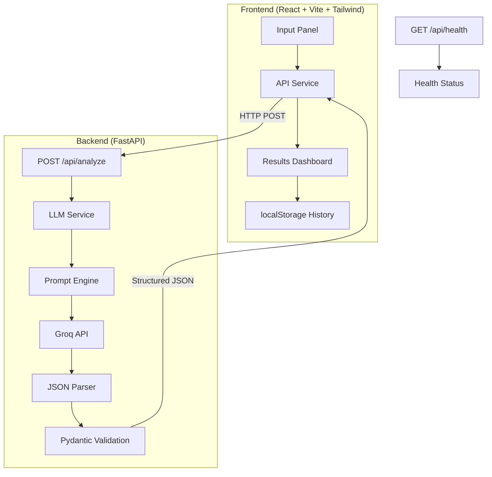

# 🐛 BugPilot — AI Bug Diagnosis & Debugging Assistant

"Check it out! : * https://bug-pilot-five.vercel.app/

**Turn confusing errors into actionable fixes.**

BugPilot is a developer tool that analyzes stack traces, identifies root causes, and generates code fixes using AI. Unlike generic chatbots, BugPilot follows a structured debugging pipeline and returns structured diagnostic reports — not free-text responses.

---

## Features

- **Structured AI Analysis** — Error parsing → root cause → code identification → fix generation → prevention
- **Three Analysis Modes** — Quick Fix, Deep Analysis, and Explain Like I'm a Beginner
- **Error Flow Visualization** — Visual chain showing how errors propagate through your codebase
- **Problematic Code Highlighting** — Syntax-highlighted code with the suspected bug line marked
- **Suggested Fix + Alternative** — Two approaches with explanations of why they work
- **Confidence Scoring** — Evidence-based confidence with explicit reasoning (never fabricates certainty)
- **Severity Classification** — Critical / High / Medium / Low with defined criteria
- **Example Bugs** — 4 pre-built examples (Python, Java, JavaScript, SQL) for instant demos
- **Analysis History** — Local storage of previous analyses with full replay
- **Demo Mode** — Full UI experience without an API key, clearly labeled as non-AI

---

## Architecture



### Debugging Pipeline

```
User Input → Error Extraction → Root-Cause Analysis → Code Identification
    → Fix Generation → Explanation → Prevention Recommendations
```

The AI is instructed to follow this pipeline and explicitly separate evidence from inference.

---

## Tech Stack

| Layer | Technology | Purpose |
|-------|-----------|---------|
| Frontend | React 19, Vite 8 | SPA with fast HMR |
| Styling | Tailwind CSS 4, Custom CSS | Dark developer-focused theme |
| Icons | Lucide React | Consistent icon system |
| Backend | Python, FastAPI | Async API with auto-generated docs |
| AI | Groq API (LLaMA 3.3 70B) | Fast inference (~200ms) |
| Validation | Pydantic | Structured input/output schemas |
| Storage | localStorage | Zero-infrastructure MVP persistence |

---

## How It Works

1. **Developer provides**: Error/stack trace, source code (optional), logs (optional), language, context
2. **Backend receives** the request at `POST /api/analyze`
3. **Prompt engine** builds a structured system prompt based on the selected analysis mode
4. **LLM** follows the 10-step debugging pipeline and returns structured JSON
5. **Pydantic** validates the response against the `AnalysisResponse` schema
6. **Frontend** renders each section as a dedicated component — not as raw text

---

## Installation

### Prerequisites

- Node.js 18+ and npm
- Python 3.10+
- A Groq API key ([get one free](https://console.groq.com))

### Setup

```bash
# Clone the repository
git clone <repo-url>
cd bugpilot

# Backend
cd backend
pip install -r requirements.txt

# Create .env with your API key
cp ../.env.example ../.env
# Edit .env and add your GROQ_API_KEY

# Frontend
cd ../frontend
npm install
```

### Running

```bash
# Terminal 1: Start the backend
cd backend
python -m uvicorn main:app --host 0.0.0.0 --port 8000

# Terminal 2: Start the frontend
cd frontend
npm run dev
```

Open http://localhost:5173 in your browser.

> **No API key?** BugPilot works in demo mode — you'll see a clearly labeled sample analysis.

---

## Environment Variables

| Variable | Required | Description |
|----------|----------|-------------|
| `GROQ_API_KEY` | Optional* | Groq API key for LLM analysis |

*Without a key, BugPilot returns clearly labeled demo responses.

Create a `.env` file in the project root:

```env
GROQ_API_KEY=your_groq_api_key_here
```

---

## API Endpoints

### `GET /api/health`

Returns backend status and whether the LLM is configured.

```json
{
  "status": "ok",
  "version": "1.0.0",
  "llm_configured": true
}
```

### `POST /api/analyze`

Analyzes a bug and returns a structured debugging report.

**Request:**
```json
{
  "error": "NullPointerException: Cannot invoke \"User.getName()\"...",
  "code": "User user = repository.findById(id);\nreturn user.getName();",
  "logs": "[ERROR] 500 Internal Server Error",
  "language": "Java",
  "context": "User profile page crashes for non-existent users",
  "mode": "deep"
}
```

**Response:** Structured JSON with `title`, `severity`, `root_cause`, `confidence`, `error_chain`, `problematic_code`, `suggested_fix`, `prevention`, and more.

---

## Example

Click any of the 4 built-in examples to instantly see BugPilot in action:

| Example | Language | Error Type |
|---------|----------|-----------|
| 🐍 Python IndexError | Python | List index out of range in batch processing |
| ☕ Java NullPointerException | Java | Null dereference from repository query |
| 🟨 JavaScript TypeError | JavaScript | Accessing `.map()` on undefined state |
| 🗄️ SQL IntegrityError | Python/SQL | Duplicate key violation on user registration |

---

## Project Structure

```
bugpilot/
├── frontend/
│   ├── src/
│   │   ├── components/       # 14 React components
│   │   │   ├── Header.jsx
│   │   │   ├── ErrorInputPanel.jsx
│   │   │   ├── AnalysisModes.jsx
│   │   │   ├── ExampleBugs.jsx
│   │   │   ├── LoadingState.jsx
│   │   │   ├── AnalysisResults.jsx
│   │   │   ├── BugOverview.jsx
│   │   │   ├── RootCause.jsx
│   │   │   ├── ErrorChain.jsx
│   │   │   ├── ProblematicCode.jsx
│   │   │   ├── SuggestedFix.jsx
│   │   │   ├── Prevention.jsx
│   │   │   ├── ConfidenceScore.jsx
│   │   │   └── HistoryPanel.jsx
│   │   ├── services/
│   │   │   └── api.js         # API client with error handling
│   │   ├── utils/
│   │   │   ├── history.js     # localStorage CRUD
│   │   │   └── mockData.js    # Example bugs + demo response
│   │   ├── App.jsx            # Main orchestration
│   │   ├── index.css          # Design system
│   │   └── main.jsx           # Entry point
│   ├── index.html
│   ├── vite.config.js
│   └── package.json
├── backend/
│   ├── main.py                # FastAPI app + routes
│   ├── models/
│   │   └── schemas.py         # Pydantic request/response models
│   ├── services/
│   │   └── llm_service.py     # Isolated Groq LLM integration
│   ├── prompts/
│   │   └── debugging_prompt.py # Structured system prompts
│   └── requirements.txt
├── .env.example
└── README.md
```

---

## Engineering Decisions

### Why FastAPI?

Async Python with automatic request validation (Pydantic), auto-generated OpenAPI docs at `/docs`, and minimal boilerplate. The `/docs` endpoint provides interactive API testing out of the box.

### Why Structured LLM Output?

The AI returns JSON matching a Pydantic schema — not free text. This enables:
- Dedicated UI components for each diagnostic section
- Type-safe validation of every response
- Graceful handling of missing/optional fields
- A product experience that feels like a developer tool, not a chatbot

### Why localStorage for MVP?

Zero infrastructure cost. No database, no auth, no deployment complexity. History persists across page reloads. For a portfolio MVP, this is the right tradeoff — the architecture is ready for a real database when needed.

### Why Code Execution is Disabled

BugPilot treats all user input as untrusted text. It never:
- Executes user-submitted code
- Runs shell commands from user input
- Allows LLM output to execute anything
- Exposes environment variables to the frontend

This is a deliberate security decision for a developer tool that handles arbitrary code.

### How Confidence is Determined

The AI is explicitly instructed to score confidence based on evidence quality:
- **High (70-100%)**: Stack trace directly points to the issue, source code confirms it
- **Moderate (40-69%)**: Some evidence supports the diagnosis but information is incomplete
- **Low (0-39%)**: Insufficient evidence for confident diagnosis

The confidence_reasoning field explains what evidence supports or limits the score. The AI is instructed to never fabricate certainty.

### Why Groq API?

- Extremely fast inference (~200ms for LLaMA 3.3 70B)
- Free tier with generous limits
- JSON mode support for structured output
- The LLM service is isolated in a single module — swap to OpenAI, Anthropic, or any provider by editing one file

---

## Future Improvements

- [ ] Real-time streaming analysis (SSE/WebSocket)
- [ ] File upload for source code and logs
- [ ] Multi-file analysis with project context
- [ ] Git integration (analyze diff, blame)
- [ ] Team sharing with shareable analysis links
- [ ] VS Code extension
- [ ] Database-backed history with search
- [ ] Custom prompt templates for specific frameworks
- [ ] Rate limiting and usage analytics
- [ ] Export analysis as PDF/Markdown

---

## License

MIT
